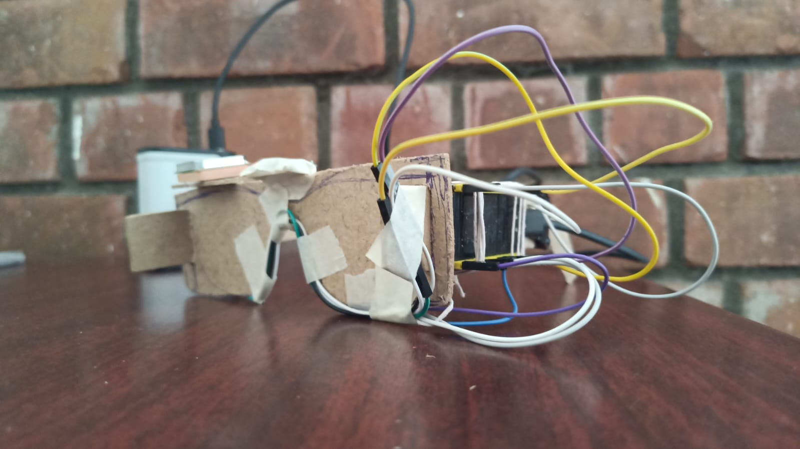

# IoT-Based Fall Detection & Emergency Alert System

## 📌 Overview
This project is a wearable IoT system that detects falls and sends real-time alerts with location.

## ⚙️ Hardware Used
- ESP32
- MPU6050 (Accelerometer + Gyroscope)
- NEO-6M GPS Module

## 🚀 Features
- Real-time fall detection
- GPS-based location tracking
- Automatic Telegram alert system
- Low-cost and portable

## 🧠 Working
1. MPU6050 detects motion
2. ESP32 processes data
3. Fall is detected using multi-stage algorithm
4. GPS retrieves location
5. Alert sent via Telegram

## 📷 Prototype


## 🔧 Setup Instructions

### 1. Install Libraries
- Adafruit MPU6050
- TinyGPS++
- WiFi

### 2. Configure
```cpp
#include <Wire.h>
#include <WiFi.h>
#include <WiFiClientSecure.h>
#include <MPU6050_tockn.h>
#include <TinyGPS++.h>
#include "time.h"

// -------- CONFIGURATION --------
const char* ssid = "YOUR_SSID"; 
const char* password = "YOUR_PASSWORD";
String botToken = "YOUR_TELEGRAM_TOKEN";
String chatID = "YOUR_CHAT_ID"; // Update this from @IDBot

// -------- PINS & THRESHOLDS --------
#define GPS_RX 16
#define GPS_TX 17
float FREE_FALL_THRESHOLD = 3.0;  
float IMPACT_THRESHOLD = 30.0; 

// -------- OBJECTS --------
MPU6050 mpu(Wire);
TinyGPSPlus gps;
HardwareSerial gpsSerial(2); 

enum State { IDLE, FREE_FALL, IMPACT, IMMOBILE };
State currentState = IDLE;
unsigned long stateStartTime = 0;

void setup() {
  Serial.begin(115200);
  Wire.begin(21, 22);
  gpsSerial.begin(9600, SERIAL_8N1, GPS_RX, GPS_TX);

  // 1. Initialize MPU6050
  mpu.begin();
  Serial.println("Calibrating MPU... Do not move!");
  delay(2000);
  mpu.calcGyroOffsets(true); 
  Serial.println("MPU Ready.");

  // 2. Connect WiFi
  WiFi.begin(ssid, password);
  while (WiFi.status() != WL_CONNECTED) {
    delay(500);
    Serial.print(".");
  }
  Serial.println("\nWiFi Connected.");

  // 3. Sync Time for Telegram
  configTime(0, 0, "pool.ntp.org");
  time_t now = time(nullptr);
  while (now < 8 * 3600 * 2) {
    delay(500);
    now = time(nullptr);
  }
  Serial.println("System Armed & Ready!");
}

void loop() {
  // --- Constant GPS Background Task ---
  while (gpsSerial.available() > 0) {
    gps.encode(gpsSerial.read());
  }

  // --- MPU Update & Magnitude Calculation ---
  mpu.update();
  float ax = mpu.getAccX() * 9.81;
  float ay = mpu.getAccY() * 9.81;
  float az = mpu.getAccZ() * 9.81;
  float A = sqrt(ax * ax + ay * ay + az * az);

  // --- Fall Detection State Machine ---
  switch (currentState) {
    case IDLE:
      if (A < FREE_FALL_THRESHOLD) {
        currentState = FREE_FALL;
        Serial.println("State: FREE FALL");
      }
      break;

    case FREE_FALL:
      if (A > IMPACT_THRESHOLD) {
        currentState = IMPACT;
        stateStartTime = millis();
        Serial.println("State: IMPACT");
      }
      break;

    case IMPACT:
      if (millis() - stateStartTime > 3000) { // Wait 3s to confirm immobility
        if (A < 12.0 && A > 7.0) { // Stillness (Gravity only)
           currentState = IMMOBILE;
           sendTelegramAlert();
        } else {
           currentState = IDLE;
        }
      }
      break;

    case IMMOBILE:
      delay(15000); // 15s cooldown
      currentState = IDLE;
      break;
  }
}

void sendTelegramAlert() {
  WiFiClientSecure client;
  client.setInsecure();
  
  String locationMsg = "Location%20Not%20Available%20(No%20GPS%20Fix)";
  
  if (gps.location.isValid()) {
    locationMsg = "Location%3A%20https%3A%2F%2Fwww.google.com%2Fmaps%3Fq%3D";
    locationMsg += String(gps.location.lat(), 6);
    locationMsg += "%2C";
    locationMsg += String(gps.location.lng(), 6);
  }

  Serial.println("Sending Emergency Alert...");
  if (client.connect("api.telegram.org", 443)) {
    String message = "EMERGENCY%21%20Fall%20Detected%21%0A" + locationMsg;
    String url = "/bot" + botToken + "/sendMessage?chat_id=" + chatID + "&text=" + message;

    client.print(String("GET ") + url + " HTTP/1.1\r\n" +
                 "Host: api.telegram.org\r\n" +
                 "Connection: close\r\n\r\n");
    Serial.println("Telegram Sent!");
  }
}

```

## 📈 Future Improvements
- Heart rate sensor
- Mobile app integration
- AI-based detection

## 👨‍💻 Team
- Karthikeya
- Sree charan
- Navaneeth
- Venkat
- Jaidev

